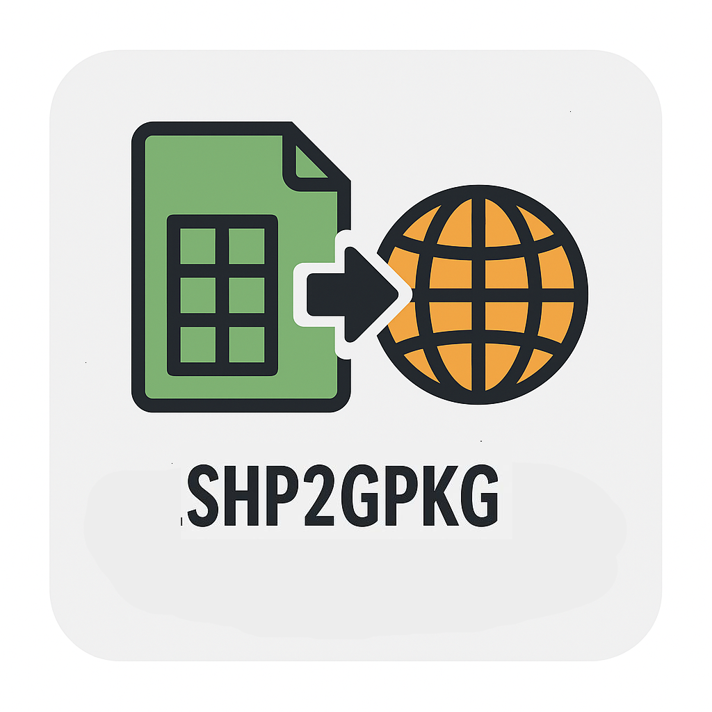

# Herramienta conv_shp2gpkg

<p align="center">
  
</p>

**conv_shp2gpkg** es una herramienta de línea de comandos escrita en Python que convierte archivos Shapefile (.shp) en GeoPackage (.gpkg), 
reproyectándolos al sistema de coordenadas deseado. Ideal para flujos de trabajo SIG automatizados.

---

## 🚀 Instalación

```bash
git clone https://github.com/K3vin91/conv_shp2gpkg.git 
cd conv_shp2gpkg
pip install .
